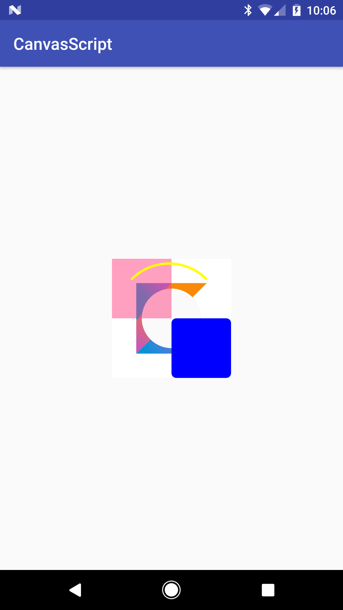

# CanvasScript
A canvas rendering wrapper for Android's Canvas and Paint classes

[ ](https://bintray.com/52inc/CanvasScript/CanvasScript/_latestVersion)

## Include
```groovy
compile 'com.52inc:canvasscript:1.0.1'
```

## How-to-Use

There are two ways to to utilize the wrapper.

1. **Creating a new Bitmap to render to**

```java
CanvasScript.create(int width, int height)
CanvasScript.create(int width, int height, Bitmap.Config config)
CanvasScript.create(Bitmap bitmap);
```

This will create a new script object initialized with new (or provided) bitmap where all subsequent drawing calls will be rendered to and returned.

2. **Wrap an existing canvas**

```java
CanvasScript.wrap(Canvas canvas)
```

This will return a script instance wrapped around an existing `Canvas` (i.e. if you are trying to use the script to render in a custom view object) where all drawing calls will be directed and rendered to.

-

Once you have initialized your script object you can then start chaining drawing and paint calls that will be combined sequentially in the order they were called when you call the `.draw()` function. If you created your script using **Method #1** then it will return the provided/created `Bitmap` that was drawn upon. If you created your script using **Method #2** then it will return `null`. 

### Methods
There are basically **two** groups of methods: **Paint** methods, and **Canvas** Methods.

#### Paint

These methods modify an internally tracked `Paint` object that can be implicitly provided for all the `Canvas` drawing calls so you don't have to keep track of creating and supplying your own (unless you want to).

[`CanvasScript.java L151 - L355`](https://github.com/52inc/CanvasScript/blob/master/library/src/main/java/com/ftinc/canvasscript/CanvasScript.java#L151-L355)

One of these methods must be called to initialize the internal paint object before calling and implicity canvas method or else you will get an `IllegalStateException`

#### Canvas

These methods are instructions for calls to the `Canvas` object to be rendered sequentially:


[`CanvasScript.java L358 - L1457`](https://github.com/52inc/CanvasScript/blob/master/library/src/main/java/com/ftinc/canvasscript/CanvasScript.java#L358-L1457)

There is a version of every call to account for all possible drawing methods for their `Canvas` equivelents. There is also a duplicate call where you can supply your own `Paint` object for rendering instead of using the internally tracked one mentioned above.

#### Special

Now there are a few special methods in the API to give you some extra functionality and they are:

```java
public CanvasScript custom(@NonNull CanvasParams customParameter)
```

This call allows you to provide a custom `CanvasParams` object where you can define a custom set of `Canvas` drawing calls to the stack (i.e. If you wanted to create a parameter that auto magically sets up a PorterDuff Xfer call in one line)

```java
public CanvasScript script(CanvasScript script)
public CanvasScript script(float dx, float dy, CanvasScript script)
```

These calls allow you to chain multiple `CanvasScripts` together 

### Drawing

Once you have finished your chain of paint and canvas methods and are reading to render everything to the canvas/bitmap just call:

```java
@Nullable
public Bitmap draw()
```

If you wrapped an existing `Canvas` object when you created your `CanvasScript` then this will return `null`, otherwise it will return the `Bitmap` that it created will all the subsequent drawing calls made to it.

##### Special note about save/restore calls

If you make any `Canvas` save calls (i.e. `save()`, `saveLayer(...)`, etc) the CanvasScript will internally keep track of the returned integer (i.e. the save count) so when you later call `restore()` it will automatically restore to that saved count.

### Example

```java
CanvasScript.wrap(canvas)
        .saveLayer()
        .bitmap(image, measuredWidth, measuredHeight)
        .porterDuffXfer(PorterDuff.Mode.CLEAR)
        .circle(measuredWidth/2f, measuredHeight/2f, measuredWidth/4f)
        .paint(null)
        .restore()
        .color(color(R.color.colorAccent))
        .alpha(0.5f)
        .rect(0f, 0f, measuredWidth/2f, measuredHeight/2f)
        .alpha(1f)
        .color(Color.BLUE)
        .roundedRect(measuredWidth/2f, measuredHeight/2f, measuredWidth.toFloat(), measuredHeight.toFloat(), 20f)
        .color(Color.YELLOW)
        .style(Paint.Style.STROKE)
        .strokeWidth(10f)
        .strokeCap(Paint.Cap.ROUND)
        .arc(20f, 20f, measuredWidth.toFloat() - 40f, measuredHeight.toFloat() - 40f, -135f, 90f, false)
        .draw()
```

The result looks like this:

</img>